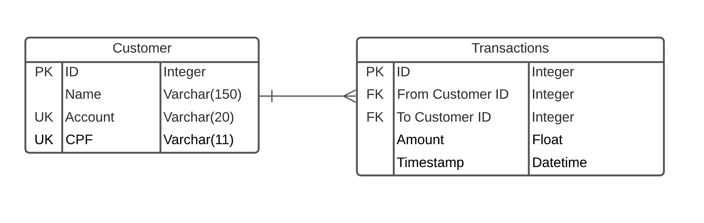
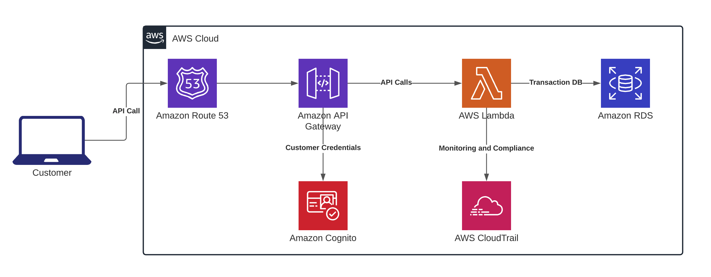

# Bank Application

API de saque e transferência

## Install Dependencies

```bash
pip install -r requirements.txt
```

For more information on pip requirements, files check the [documentation](https://pip.pypa.io/en/stable/reference/pip_install/#requirements-file-format)

## Database

### Model



### Setup

```bash
# Create a migration repository
flask db init

# Generate migration
flask db migrate

# Apply migration
flask db upgrade
```

For manually creating a customer:

```python
from app import db
from app.models import Customer, Transaction

# Create Customer 1
c1 = Customer(name="Alexandre", account="12345", cpf="12345678900")
db.session.add(c1)
db.session.commit()

# Add funds to play with transactions and withdraw
transaction = Transaction(
    type="Deposit",
    to_customer_id=c1.id,
    amount=100000,
  )

db.session.add(transaction)
db.session.commit()

# Create Customer 2
c2 = Customer(name="Tester", account="12344", cpf="12345678901")
db.session.add(c2)
db.session.commit()
```

## Run app

```bash
# Create the virtual environment
python3 -m venv venv

# Install Dependencies
pip install -r requirements.txt

# Run Flask
flask run
```

## Manual testing the app

### Balance

```bash
curl "http://127.0.0.1:5000/balance/1"
```

### Withdraw

```bash
curl -X "POST" "http://127.0.0.1:5000/withdraw" \
     -H 'Content-Type: application/json; charset=utf-8' \
     -d $'{
  "from_customer_id": "1"
  "amount": "100",
}'
```

### Transfer

```bash
curl -X "POST" "http://127.0.0.1:5000/transfer" \
     -H 'Content-Type: application/json; charset=utf-8' \
     -d $'{
  "from_customer_id": "1"
  "to_customer_id": "2",
  "amount": "100",
}'
```

## Future implementations

* Customer authentication. You can currently POST to the API and add any transactions without validating that you are the customer creating the transaction.
* Improve Customer model with more required data
* Migrate from SQLite to PostgreSQL
* Migrate to Cloud Provider

## Proposed Serverless Architecture



This is an oversimplification of the architecture:

* Use Route53 to define the DNS.
* API Gateway to create the internet accessible API endpoints or create a VPC for internal use
* Lambdas to run the Flask API
* Amazon RDS to store the transactions
* Amazon Cognito to store user credentials and provide authentication
* AWS CloudTrail for audit and compliance
* We would also use AWS CloudWatch for logs

## Documentation

* [Flask](https://flask.palletsprojects.com/en/1.1.x/quickstart/#a-minimal-application)
* [Flask-SQLAlchemy](https://flask-sqlalchemy.palletsprojects.com/en/2.x/)
* [SQLAlchemy Migrate](https://opendev.org/x/sqlalchemy-migrate)
